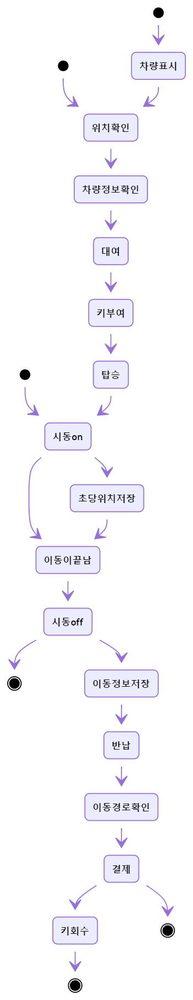

# we HAvE a car :car: !!!

####  모빌리티 시스템을 위한 👬WeCar👭의 간단한 카쉐어링 플랫폼

 

### Why  HAVE ?

> 디지털키와 간편결제 시스템 등 많은 모빌리티, CCS 시스템을 활용하여  많은 사용자들이 직접 차를 사지 않아도 차를 가진 것처럼 `HAVE` 편리하게 이용할 수 있는  카쉐어링 플랫폼을 목적으로 구성한 프로젝트 입니다. 
>
> [@heyheygo99](https://github.com/heyheygo99) [@HyunSeokki](https://github.com/HyunSeokki) [@ahlim721](https://github.com/ahlim721) [@shyeonj](https://github.com/shyeonj)

 

### Ⅰ. 프로젝트의 구성

총 4주의 기간동안 기획, 개발을 효율적으로 하기 위하여 3개의 프로젝트 구간을 나누어서 진행하고 있습니다.

1. ##### 1주차 (2020.02.05 ~ 2020.02.10)

   * 프로젝트 기획, URL 명세서, DB 설계 및 DB 구축, 서버 환경 구축

2. ##### 2주차 (2020.02.10 ~ 2020.02.14)  

   * 분담 기능 구현

3. ##### 3주차 (2020.02.17 ~ 2020.02.21)  

   * 분담 기능 구현 및 테스트, 유지보수
   * 추가 기능 구현

4. ##### 4주차 (2020.02.24 ~ 2020.02.28) 

   * 추가 기능 구현 마무리
   * 테스트 및 유지보수, 발표 준비

 

### Ⅱ. 프로젝트 기술 사양

|            | 이름            | 버전     | 기타       |
| ---------- | --------------- | -------- | ---------- |
| WAS/서버   | Apache / Tomcat |          |            |
| DB         | ORACLE          | 12.2.0.1 | ojdbc8     |
| 백엔드     | Java            | 8        | jdk1.8     |
| 프론트엔드 | JSP             |          |            |
| 프레임워크 | Spring          |          | ABLE_Frame |
| Open API   | Kakao Map API   |          |            |
| 통신       | HTTP / REST api |          |            |

 

### Ⅲ. 시퀀스 다이어그램

