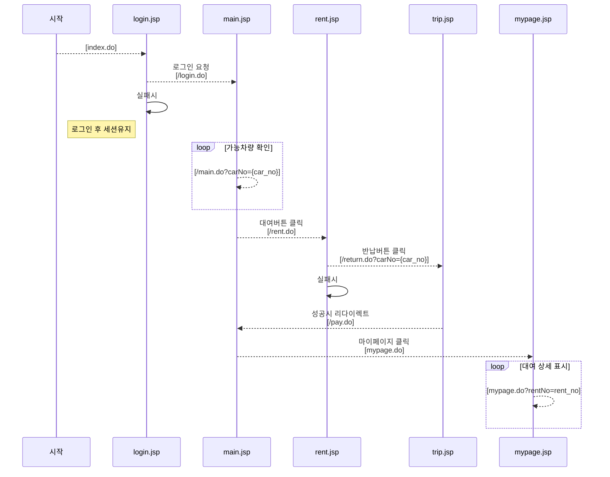
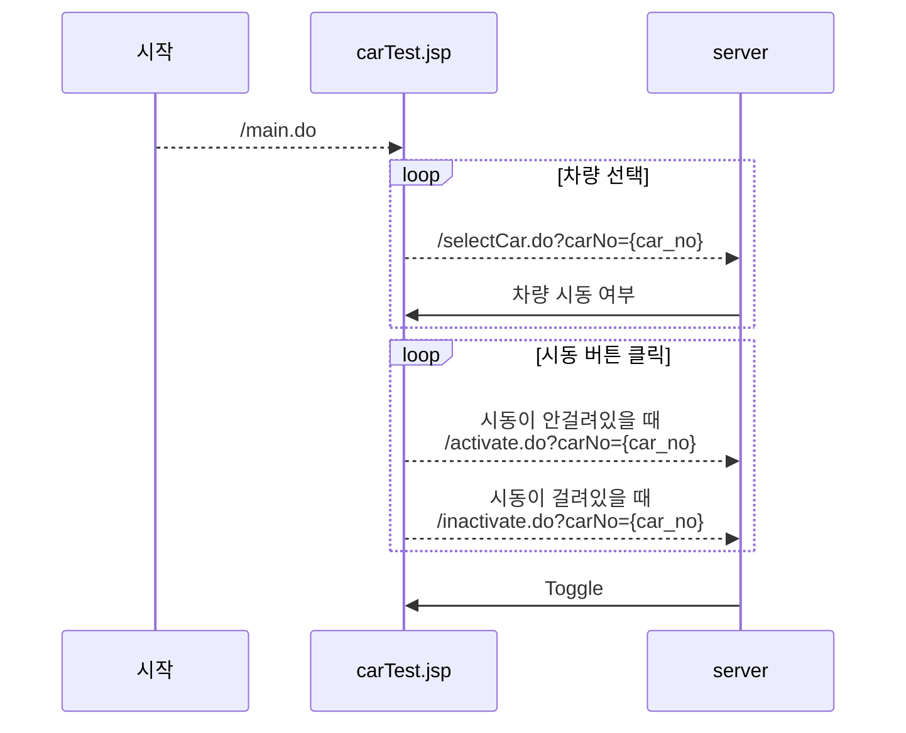

# 화면설계 정의서

#### **사용자버전**

| 화면       | 상황             | 상세                                                         |
| ---------- | ---------------- | ------------------------------------------------------------ |
| login.jsp  |                  | 로그인 화면  (ID, Password 입력)                             |
| main.jsp   |                  | 빌릴 수 있는  차량의 정보를 가져와서 지도에 표시 + 마이페이지 버튼 차량 상세  오버레이 (닫기가 가능한 오버레이) + 대여버튼 |
|            | 대여버튼 클릭 시 | DB 대여  데이터 기록 및 대여 확인 표시 페이지로 이동   {carNo : [car_no], id : [id]} [POST] |
| rent.jsp   |                  | 내가 대여한  차종 + 디지털 카키 표시 + 반납 버튼             |
| trip.jsp   |                  | 이동 경로  표시(경로 데이터 가져옴) + 결제 버튼              |
| mypage.jsp |                  | 대여 리스트 해당 대여리스트  아래에 (모달팝업으로) 이동경로 표시 |

#### 자동차버전

| 화면        | 상황      | 상세                                                         |
| ----------- | --------- | ------------------------------------------------------------ |
| carTest.jsp |           | 차량 선택  리스트 + 시동 버튼(시동 상태에 따른 색 변화)      |
|             | 차량 선택 | /selectCar.do?carNo={car_no} [GET] 해당 차량 시동 여부를 가져옴. |
|             | 시동 on   | /activate.do?carNo={car_no} [GET]                            |
|             | 시동 off  | /inactivate.do?carNo={car_no} [GET]                          |

